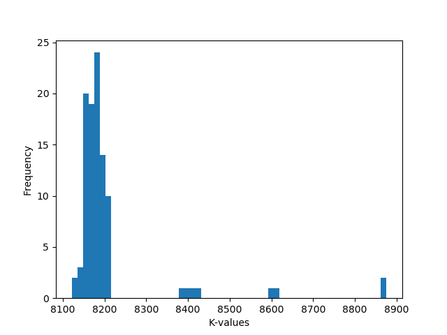

# RailNL

RailNL consists of a problem which we as BetereNS try to solve.

## Getting Started

The most important goal for this case is to design an optimized route for intercitytrains.
This case consists (out) of two parts.

### Part one - North- and South-Holland

In part one the assignment is to optimize the quality of the routes (north- and south-Holland only) by adhering to a number of restrictions. These restrictions are:

- a maximum number of 7 routes
- a timeframe of 2 hours
- all connections must be ridden

To improve the quality of the routes we will use this formula:

```
K = p*10000 - (T*100 + Min)
K = quality of the routes
p = fraction of the ridden connections (between 0 and 1)
T = number of routes
Min = number of minutes
```

### Part two - The Netherlands

The goal of the second part of the case remains the same. The same formula will be used to optimize the K-value of the routes. Because we are using all the stations and connections from the Netherlands, the restrictions are a bit different:

- a maximum number of 20 routes
- a timeframe of 3 hours
- all connections must be ridden

### Examples

Three examples of generated output could be a plot, a graph, a tabel.
These examples are shown below:




### Prerequisites

To run the following code some dependencies are needed these can be found in `requirements.txt`. They can be installed using the following command:

```
pip install -r requirements.txt
```

### Structure

The structure of the files are as follows there are 4 main folders `code`, `data`, `output_files` and `plots`. `code` contains all the code we have written. `data` contains the data used in the research. `output_files` contains raw csv files of the best samples we have found. `plots` contains different graphs which show more insight into how different algorithms behave and compare to each other. In the tree below you can find some more information about every subfolder. Furthermore we have some files in the root which are `main.py` containing the script to run the function according to the users needs.

```bash
.
.
├── code
│   ├── algorithmRunner # Contains classes which run multiple samples of algorithm
│   ├── algorithms      # Contains different algorithm Classes
│   ├── mainCode        # Contains main object used e.g. Trains, Stations
│   └── visualization   # Code for visualization of output
├── data
├── output_files        # Raw csv files with output of best sample from run
└── plots
    ├── boxplots        # Boxplots of n samples from run
    └── histograms      # Contains histograms of n samples for every algorithm
```

### Usage

To get started right away using the

<!--  -->


```
python main.py
```

```
python main.py 1 1 2 3
```

## Used Algorithms

### Random algorithm

korte uitleg

### Greedy algorithm

korte uitleg

### Hillclimber algorithm

korte uitleg

### Hillclimber-alt algorithm

korte uitleg

## Authors

- Zulkarneyn Catak
- Adrian Ruessink
- Robert Youseff

## Acknowledgments

- Marleen & Pamela
- minor programmeren van de UvA
- Random person on Stackoverflow
